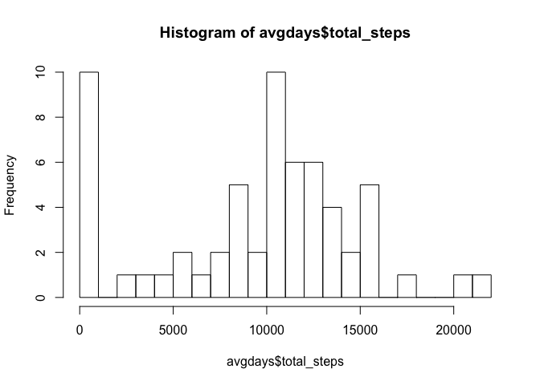
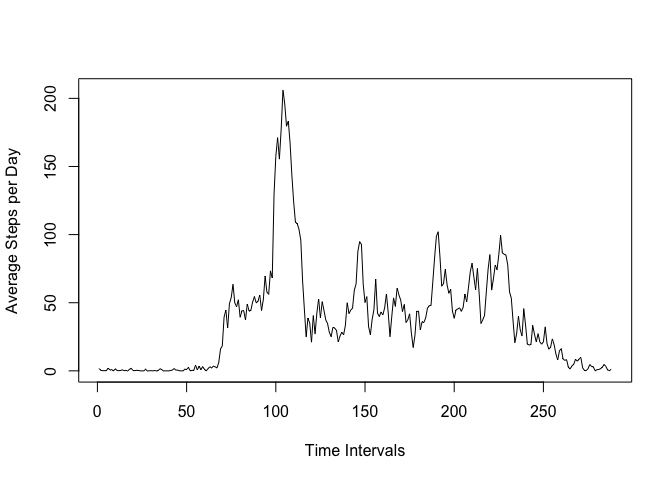
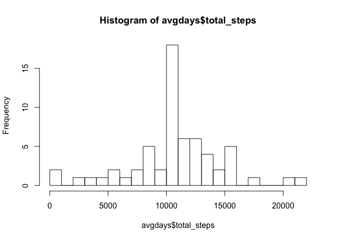
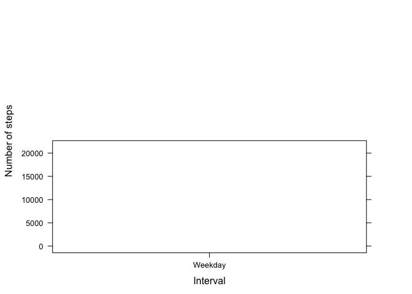

# Reproducible Research: Peer Assessment 1
This assignment makes use of data from a personal activity monitoring device. This device collects data at five-minute intervals through out the day. The data set consists of two months of data from an anonymous individual collected during the months of October and November 2012 and include the number of steps taken in five-minute intervals each day.

## Loading and preprocessing the data


```r
data <- read.csv("activity.csv")
summary(data)
```

```
##      steps                date          interval     
##  Min.   :  0.00   2012-10-01:  288   Min.   :   0.0  
##  1st Qu.:  0.00   2012-10-02:  288   1st Qu.: 588.8  
##  Median :  0.00   2012-10-03:  288   Median :1177.5  
##  Mean   : 37.38   2012-10-04:  288   Mean   :1177.5  
##  3rd Qu.: 12.00   2012-10-05:  288   3rd Qu.:1766.2  
##  Max.   :806.00   2012-10-06:  288   Max.   :2355.0  
##  NA's   :2304     (Other)   :15840
```
The date is initially stored as a factor. It is converted to Date() format.

Time is represented in military time intervals. To make time more readable, I have changed the class to POSIXlt through strptime() and formatted it %H:%M. Here is the resulting table:

```r
data$date <- as.Date(data$date)

data$interval <- as.character(data$interval)
for (i in 1:length(data$interval)) {
    if (nchar(data$interval[i]) == 1){
        data$interval[i] <- paste("000", data$interval[i], sep = "")
    } else if (nchar(data$interval[i]) == 2){
        data$interval[i] <- paste("00", data$interval[i], sep = "")
    } else if (nchar(data$interval[i]) == 3){
        data$interval[i] <- paste("0", data$interval[i], sep = "")
    }
}
data$interval <- format(strptime(data$interval, format = "%H%M"), format = "%H:%M")

head(data)
```

```
##   steps       date interval
## 1    NA 2012-10-01    00:00
## 2    NA 2012-10-01    00:05
## 3    NA 2012-10-01    00:10
## 4    NA 2012-10-01    00:15
## 5    NA 2012-10-01    00:20
## 6    NA 2012-10-01    00:25
```

## What is mean total number of steps taken per day?

To answer this question, calculate the sum of all steps taken in the data across the days spanned.


```r
library("dplyr")
```

```
## 
## Attaching package: 'dplyr'
```

```
## The following objects are masked from 'package:stats':
## 
##     filter, lag
```

```
## The following objects are masked from 'package:base':
## 
##     intersect, setdiff, setequal, union
```

```r
sumsteps <- sum(data$steps, na.rm = TRUE)
days <- length(levels(data$date))
```

The sum of all steps taken was 570608. And a look at the levels of factors in the date column tells us that there were 0 days measured in the data set.  
That makes the mean across all the days:  

```r
sumsteps / days
```

```
## [1] Inf
```

Let's take a look at groupings by each of the 0 days.  


```r
avgdays <- data %>%
    group_by(date) %>%
    summarize(total_steps = sum(steps, na.rm = TRUE), avg_steps = mean(steps, na.rm = TRUE), median_steps = median(steps, na.rm = TRUE))
head(avgdays)
```

```
## Source: local data frame [6 x 4]
## 
##         date total_steps avg_steps median_steps
## 1 2012-10-01           0       NaN           NA
## 2 2012-10-02         126   0.43750            0
## 3 2012-10-03       11352  39.41667            0
## 4 2012-10-04       12116  42.06944            0
## 5 2012-10-05       13294  46.15972            0
## 6 2012-10-06       15420  53.54167            0
```

```r
hist(avgdays$total_steps, breaks = 20)
```

<!-- -->
  
The mean of total number of steps per day is 9354.2295082 and the median of the total number of steps per day is 10395.

## What is the average daily activity pattern?

Let's look at the average of each interval across all days.


```r
avgintervals <- data %>%
    group_by(interval) %>%
    summarize(total_steps = sum(steps, na.rm = TRUE), avg_steps = mean(steps, na.rm = TRUE), median_steps = median(steps, na.rm = TRUE))
head(avgintervals)
```

```
## Source: local data frame [6 x 4]
## 
##   interval total_steps avg_steps median_steps
## 1    00:00          91 1.7169811            0
## 2    00:05          18 0.3396226            0
## 3    00:10           7 0.1320755            0
## 4    00:15           8 0.1509434            0
## 5    00:20           4 0.0754717            0
## 6    00:25         111 2.0943396            0
```

```r
plot.ts(avgintervals$avg_steps, xlab = "Time Intervals", ylab = "Average Steps per Day")
```

<!-- -->

```r
max_intervalsteps <- avgintervals[which.max(avgintervals$avg_steps),]
```

The interval with the greatest number of steps over the course of the data set was at 08:35 with an average of 206.1698113 steps.

## Inputing missing values

Let's start with calculating the number of missing elements in the data set.

```r
sum(is.na(data$steps))
```

```
## [1] 2304
```
Let's do something meaningful about these missing elements.


```r
data[is.na(data$steps), 'steps'] <- mean(avgintervals$avg_steps)
sum(is.na(data$steps))
```

```
## [1] 0
```

We took the average steps per interval of all days and replaced the NAs.


```r
avgdays <- data %>%
    group_by(date) %>%
    summarize(total_steps = sum(steps, na.rm = TRUE), avg_steps = mean(steps, na.rm = TRUE), median_steps = median(steps, na.rm = TRUE))
hist(avgdays$total_steps, breaks = 20)
```

<!-- -->

```r
head(avgdays)
```

```
## Source: local data frame [6 x 4]
## 
##         date total_steps avg_steps median_steps
## 1 2012-10-01    10766.19  37.38260      37.3826
## 2 2012-10-02      126.00   0.43750       0.0000
## 3 2012-10-03    11352.00  39.41667       0.0000
## 4 2012-10-04    12116.00  42.06944       0.0000
## 5 2012-10-05    13294.00  46.15972       0.0000
## 6 2012-10-06    15420.00  53.54167       0.0000
```
This changes the data dramatically on days that previously didn't have info as you can see.

## Are there differences in activity patterns between weekdays and weekends?


```r
avgdays[,"day"] <- c(weekdays(avgdays$date))

ifelse(avgdays$day == "Saturday" | avgdays$day == "Sunday", avgdays$day <- "Weekend", avgdays$day <- "Weekday")
```

```
##  [1] "Weekday" "Weekday" "Weekday" "Weekday" "Weekday" "Weekend" "Weekend"
##  [8] "Weekday" "Weekday" "Weekday" "Weekday" "Weekday" "Weekend" "Weekend"
## [15] "Weekday" "Weekday" "Weekday" "Weekday" "Weekday" "Weekend" "Weekend"
## [22] "Weekday" "Weekday" "Weekday" "Weekday" "Weekday" "Weekend" "Weekend"
## [29] "Weekday" "Weekday" "Weekday" "Weekday" "Weekday" "Weekend" "Weekend"
## [36] "Weekday" "Weekday" "Weekday" "Weekday" "Weekday" "Weekend" "Weekend"
## [43] "Weekday" "Weekday" "Weekday" "Weekday" "Weekday" "Weekend" "Weekend"
## [50] "Weekday" "Weekday" "Weekday" "Weekday" "Weekday" "Weekend" "Weekend"
## [57] "Weekday" "Weekday" "Weekday" "Weekday" "Weekday"
```

```r
levels(avgdays$day)
```

```
## NULL
```

```r
avgdays <- avgdays %>% group_by(day)
table(avgdays$day)
```

```
## 
## Weekday 
##      61
```

```r
library(lattice)
xyplot(avgdays$total_steps ~ avgdays$day, 
           data = avgdays,
           type = "l",
           xlab = "Interval",
           ylab = "Number of steps",
           layout=c(1,2))
```

```
## Warning in order(as.numeric(x)): NAs introduced by coercion
```

```
## Warning in diff(as.numeric(x[ord])): NAs introduced by coercion
```

```
## Warning in (function (x, y, type = "p", groups = NULL, pch = if
## (is.null(groups)) plot.symbol$pch else superpose.symbol$pch, : NAs
## introduced by coercion
```

<!-- -->
